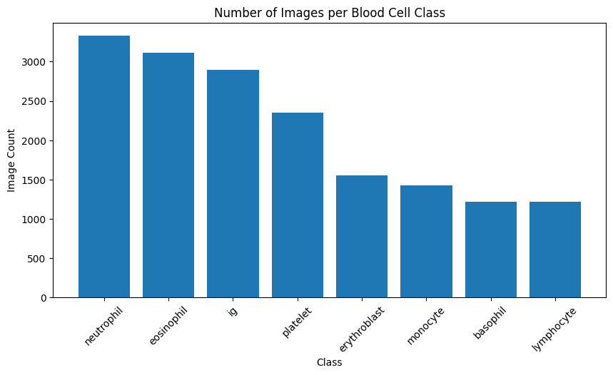
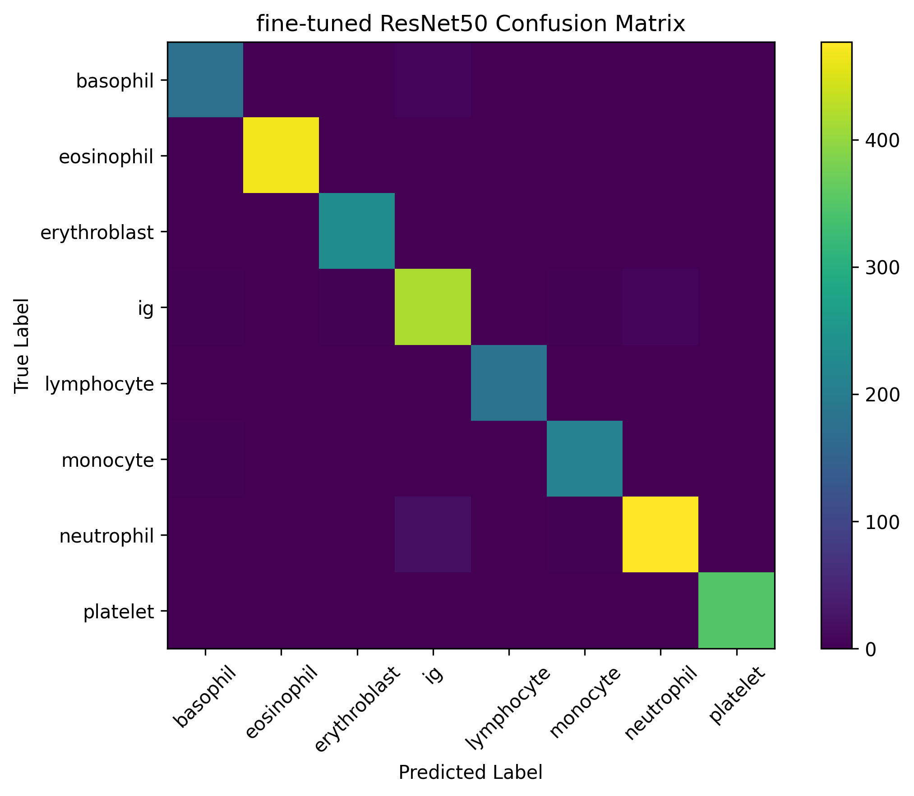
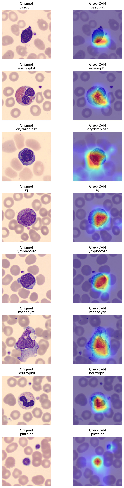

# Explainable Blood Cell Classification Using Deep Learning and Grad-CAM

## Project Overview

This project develops an interpretable deep learning pipeline for blood cell classification using microscopy images.

The study compares a custom Convolutional Neural Network (CNN) with transfer-learning approaches based on ResNet50 and investigates model interpretability using Grad-CAM.

The primary objective is to determine whether modern deep learning models can accurately classify blood cell types while providing visual explanations for their predictions.

## Dataset

Blood Cells Image Dataset (Kaggle)

The dataset contains over 17,000 microscopy images across eight blood cell classes:

- Basophil
- Eosinophil
- Erythroblast
- Immature Granulocyte (IG)
- Lymphocyte
- Monocyte
- Neutrophil
- Platelet

## Setup

Install dependencies:

```bash
pip install -r requirements.txt
```

Download the dataset:

```bash
python download_data.py
```

### Class Distribution



## Data Preparation

The following preprocessing steps were applied before model training:

- Image resizing to **224 × 224**
- Image normalization using ImageNet statistics
- Data augmentation:
  - Random horizontal flipping
  - Random rotation (±10°)
- Stratified train / validation / test split
- PyTorch DataLoader pipeline for efficient training

### Why These Steps?

- Resizing ensures a consistent input size for CNN and ResNet50 models.
- Normalization improves training stability and matches the requirements of pretrained ImageNet models.
- Data augmentation helps reduce overfitting and improves generalization.
- Stratified splitting preserves class distributions across training, validation, and test sets.
- 
## Models Evaluated

### CNN Baseline

A custom convolutional neural network consisting of:

- 3 convolutional blocks
- ReLU activations
- Max pooling
- Fully connected classifier

### ResNet50 (Frozen)

Pretrained ResNet50 with frozen feature extraction layers and a trainable classification head.

### ResNet50 (Fine-Tuned)

Pretrained ResNet50 with the final residual block unfrozen and fine-tuned on blood cell images.

## Results

| Model | Accuracy | Macro F1 | Weighted F1 |
|---------|---------:|---------:|---------:|
| CNN Baseline | 0.91 | 0.90 | 0.91 |
| ResNet50 (Frozen) | 0.89 | 0.88 | 0.89 |
| ResNet50 (Fine-Tuned) | **0.98** | **0.98** | **0.98** |

### Key Findings

- The CNN baseline achieved 91% test accuracy.
- Frozen transfer learning performed slightly worse than the CNN baseline.
- Fine-tuning ResNet50 significantly improved performance and achieved 98% test accuracy.
- Transfer learning combined with fine-tuning proved highly effective for blood cell classification.

### Fine-Tuned ResNet50 Confusion Matrix



## Explainability

### Grad-CAM

Grad-CAM was applied to the fine-tuned ResNet50 model to visualize which image regions contributed most strongly to model predictions.

The visualizations show that the model primarily focuses on biologically meaningful cellular structures such as:

- Nuclear morphology
- Granulation patterns
- Cellular texture
- Cell boundaries

rather than background artifacts or surrounding red blood cells.

### Grad-CAM Examples



These results suggest that the model is learning relevant blood-cell characteristics and making predictions based on meaningful morphological features.

## Technologies

- Python
- PyTorch
- Torchvision
- NumPy
- Pandas
- Matplotlib
- Scikit-learn
- Grad-CAM

## Future Work

- EfficientNet comparison
- Vision Transformers (ViT)
- SHAP explanations
- Integrated Gradients
- Abnormal blood cell classification
- Leukemia detection applications

## Status

✅ Project completed

- Exploratory Data Analysis completed
- Data preprocessing pipeline completed
- CNN baseline implemented and evaluated
- ResNet50 transfer learning implemented and evaluated
- Fine-tuned ResNet50 achieved 98% test accuracy
- Grad-CAM explainability analysis completed

## Author

**Asal Delkhosh**

MS Data Science, Stony Brook University
